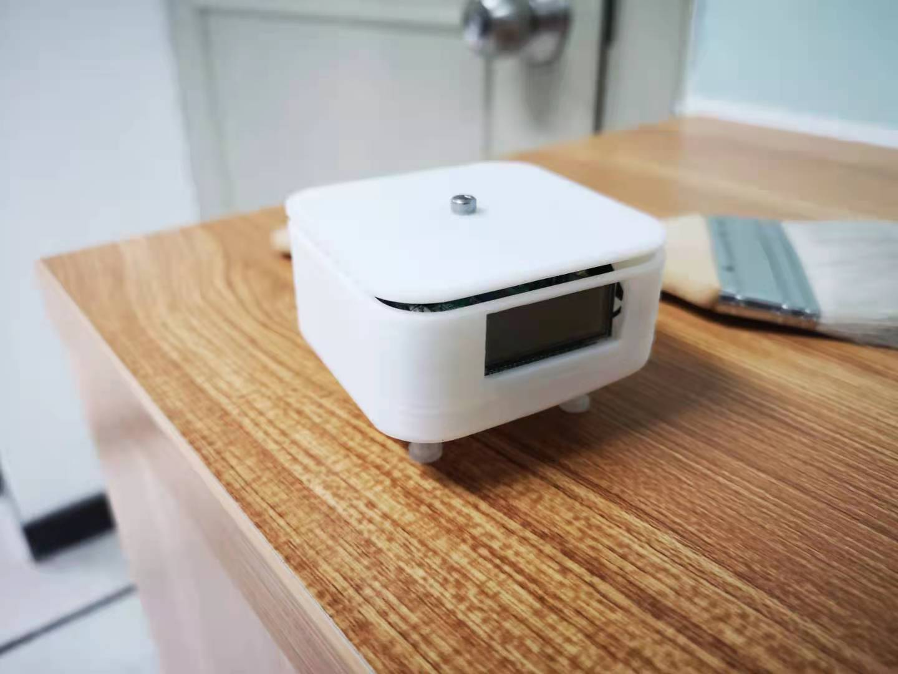
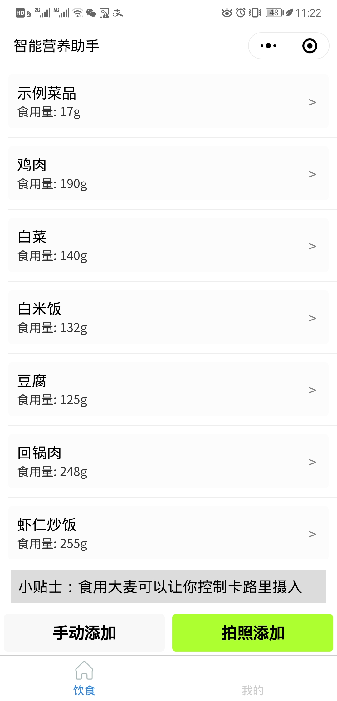
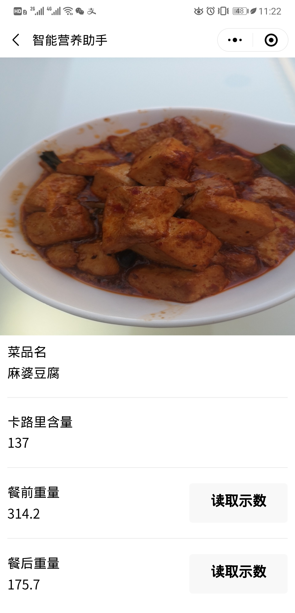
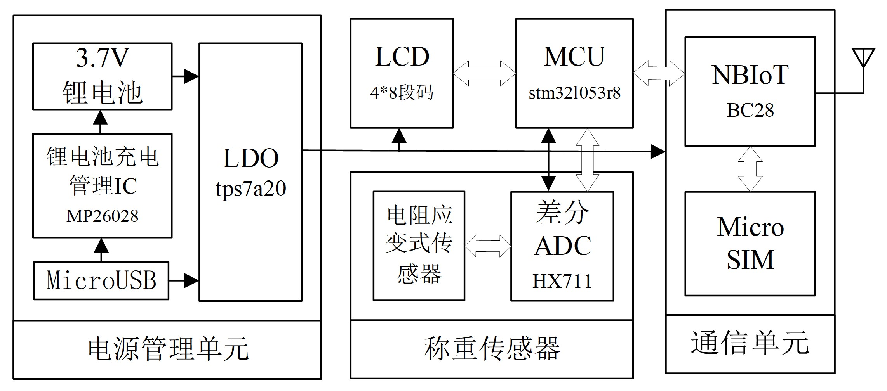

# SmartDiet 智能营养助手

> 和小伙伴一起完成的智能硬件项目

一种可联网的电子秤，结合微信小程序可以拍照识别菜品并方便快速地获取食物
重量，能够记录用户信息与饮食并给出每日推荐摄入热量，适用于学生、上班族等习
惯于食堂、外卖等单人单餐模式的群体。

该 repo 为硬件端部分，包括电路设计、PCB设计与单片机源码。

小程序端地址：

https://github.com/WenWeiZ/SmartDiet_miniprogram





## 系统功能

硬件端：

1. 电子秤开机、称重与示数显示
2. 30 秒无变化自动休眠
3. 通过按钮可将电子称从休眠模式唤醒，示数复位
4. 电池和USB 两种供电方式，充电时有指示灯提示
5. 可将目前的供电电压上传服务端用于监测
6. 可将称重稳定后的读数上传服务端

服务端：

1. 基本健康信息记录与每日热量推荐
2. 体重与卡路里每日记录曲线
3. 菜品拍照识别与记录（也可手动记录）
4. 健康小贴士推荐（服务器可每日更新）
5. 获取食物重量信息并显示与记录
6. 获取当前硬件供电电压，电压过小提醒充电

## 系统指标

| 指标描述           | 结果                |
| ------------------ | ------------------- |
| 尺寸大小           | 6.4cm x 6.4cm x 4cm |
| 产品质量           | 72g                 |
| 唤醒时间           | 1s                  |
| 称重灵敏度         | 0.1kg               |
| 称重量程           | 3kg以内             |
| 称重精度           | 1g                  |
| 工作电流           | 50mA                |
| 静态电流           | 38μA                |
| 续航时间           | 大于3个月           |
| 菜品识别平均延时   | 小于5s              |
| 小程序质量接收延时 | 小于5s              |

## 硬件框图



## 目录结构

```
├─Device
│  ├─Code						单片机源码
│  │  ├─STM32F401				用于借助“番茄闹钟”平台开发，只实现了部分功能
│  │  └─STM32L053				用于最终产品
│  │      ├─OBJ				
│  │      │  CyberBalance.hex	可执行文件
│  └─Schematic
│      │  BOM.xlsx				BOM
│      │  CYBERBALANCE.DSN		电路设计文件
│      │  cyberbalance.opj		电路设计项目文件
│      │  gerbfiles2.zip		GERBER 文件
│      │  PCB.pdf				PCB 原理图
│      │  SCHEMATIC.pdf			电路原理图
│      │
│      ├─allegro				PCB设计工程源文件
│      ├─datasheet				数据手册
```

